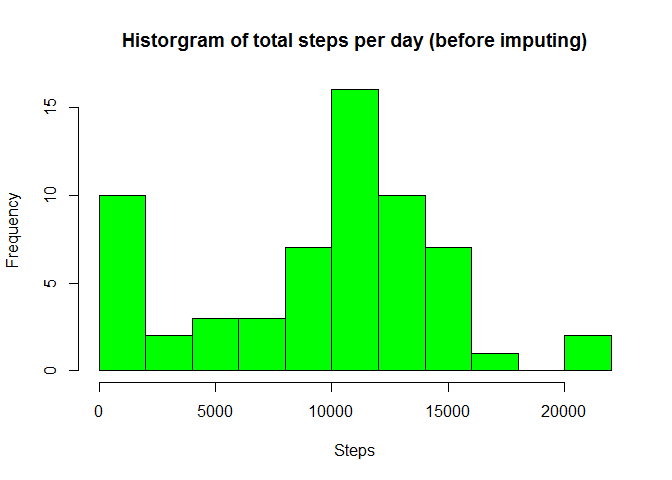
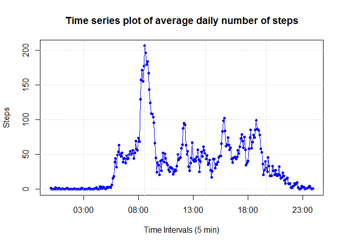
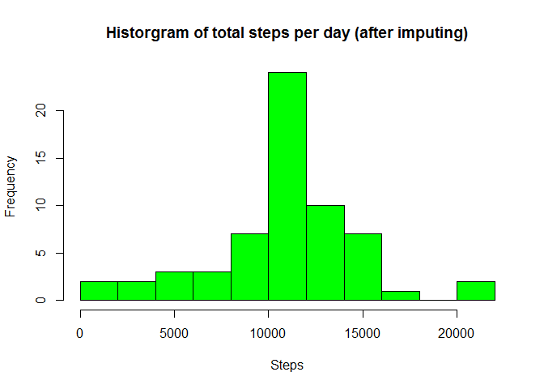
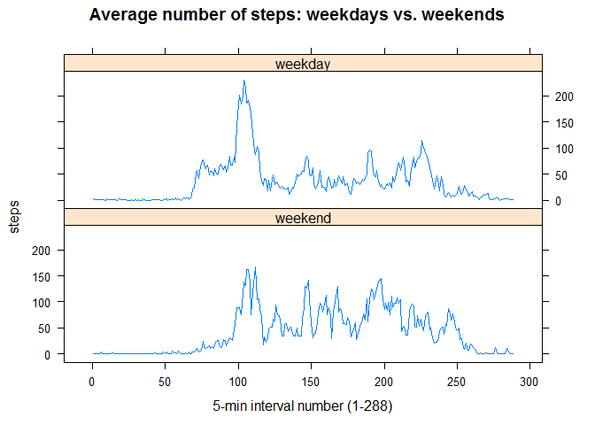

# Reproducible Research: Course Project 1 - by Philip Treigherman

## Loading libraries

```r
library( dplyr )
```

## Loading and preprocessing the data

```r
# 1. Load the data
a <- read.csv( file = "activity.csv" ) 

# 2. Process the data
# Cast the date column as dates and interval column as time interval character strings
a$date <- as.Date( a$date )
a$interval <- format( seq( as.POSIXct("2012-10-01 00:00:00", tz="GMT"), length.out=288*61, by='5 min'), '%H:%M')
```

## What is mean total number of steps taken per day?

```r
# 1. Calculate the total number of steps taken per day
sd <- summarize( group_by( a, date ), sum( steps, na.rm = TRUE ) )
names( sd ) = c( "date", "steps" )

# 2. Make a histogram of the total number of steps taken each day
hist( sd$steps, breaks = 10, col="green", xlab = "Steps", 
      main = "Historgram of total steps per day (before imputing)")
```

<!-- -->

```r
# 3. Calculate and report the mean and median of the total number of steps taken per day
summary( sd$steps )[ 3 : 4 ]
```

```
## Median   Mean 
##  10400   9354
```

## What is the average daily activity pattern?

```r
# 1. Make a time series plot of the 5-minute interval and the average number of steps taken across all days
mi <- summarize( group_by( a, interval ), mean( steps, na.rm = TRUE ) )
names( mi ) = c( "interval", "steps" )
plot( strptime( mi$interval, '%H:%M' ), mi$steps, type="o", col="blue", pch=20, 
      xlab = "Time Intervals (5 min)", ylab = "Steps", 
      main = "Time series plot of average daily number of steps" )
grid()
```

<!-- -->

```r
#2. Which 5-minute interval, on average across all days, contains the maximum number of steps
arrange( mi, desc( steps ) )[ 1, ]
```

```
## Source: local data frame [1 x 2]
## 
##   interval    steps
##      <chr>    <dbl>
## 1    08:35 206.1698
```

## Imputing missing values

```r
# 1. Calculate and report the total number of missing values in the dataset
nrow( a ) - sum( complete.cases( a ) )
```

```
## [1] 2304
```

```r
# 2. The imputing strategy is to replace NA values by the mean of the corresponding 5-minute interval

# 3. Create a new dataset that is equal to the original dataset but with the missing data filled in
a_new <- a
for( i in 1:nrow( a_new ) ) {
   if ( is.na( a_new[ i, 1 ] ) ) {
      a_new[ i, 1 ] <- mi[ mi$interval == a_new[ i, 3 ], 2 ]$steps
   }
}

# 4. Make a histogram of the total number of steps taken each day and calculate and report mean and median
sd <- summarize( group_by( a_new, date ), sum( steps, na.rm = TRUE ) )
names( sd ) = c( "date", "steps" )
hist( sd$steps, breaks = 10, col="green", xlab = "Steps", 
      main = "Historgram of total steps per day (after imputing)")
```

<!-- -->

```r
summary( sd$steps )[ 3 : 4 ]
```

```
## Median   Mean 
##  10770  10770
```
Imputing missing data makes the distribution of the total daily number of steps symmetrical (mean = median). It removed the left skew (mean < median), which was due to replacing the missing values by zeros. 

## Are there differences in activity patterns between weekdays and weekends?

```r
# 1. Create a new factor variable to differentiate weekdays and weekends
a_new <- mutate( a_new, day = factor( ( weekdays( a_new$date ) %in% c( 'Saturday', 'Sunday' ) ), 
                                      levels = c( TRUE, FALSE ), labels = c( 'weekend', 'weekday' ) ) )
mi <- summarize( group_by( a_new, interval, day ), mean( steps ) )
names( mi ) = c( "interval", "day", "steps" )
mi$interval <- factor( mi$interval )

# 2. Make a panel plot comparing weekday and weekend patterns
library(lattice)
xyplot( steps ~ as.numeric(interval) | day, data = mi, layout = c( 1, 2 ), type = "l",  
        xlab = "5-min interval number (1-288)", main = "Average number of steps: weekdays vs. weekends")
```

<!-- -->

There are some obvious differences between weekday and weekend patterns. For example, people wake up and go to bed earlier during weekdays, also the walking pattern is spread more evenly throughout the day during the weekends, as opposed to a clear spike in the morning during the weekdays (most likely associated with people going to work). 
